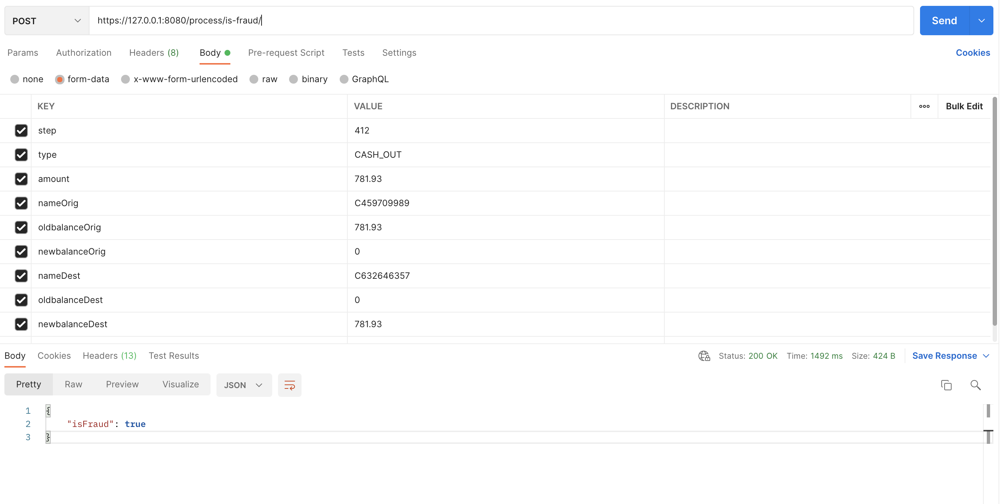

# Django Transaction Fraud Detection

## Installation of dependency

Install necessary package
```buildoutcfg
pip install -r requirements.txt
```
Install Django
```bash
pip install django
pip install djangorestframework

#Migrate database:
python manage.py makemigrations
python manage.py migrate
```


## Usage by installation above

```bash
# Run server
python manage.py runserver 127.0.0.1:8080
```
Use Postman to test API:

@[POST]




## Output json example
```buildoutcfg
{
    "isFraud": True
}
```

## Maintainer
- @hoang_pham (hoang.a3.lqd@gmail.com)

